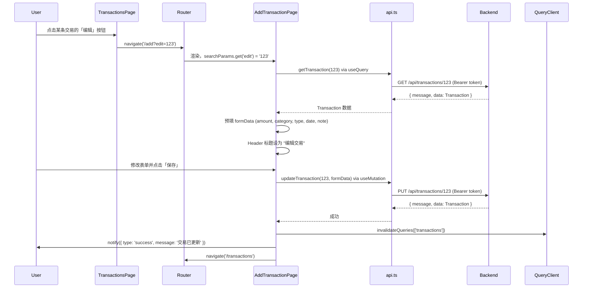
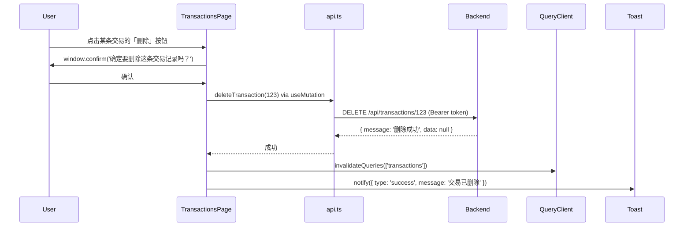
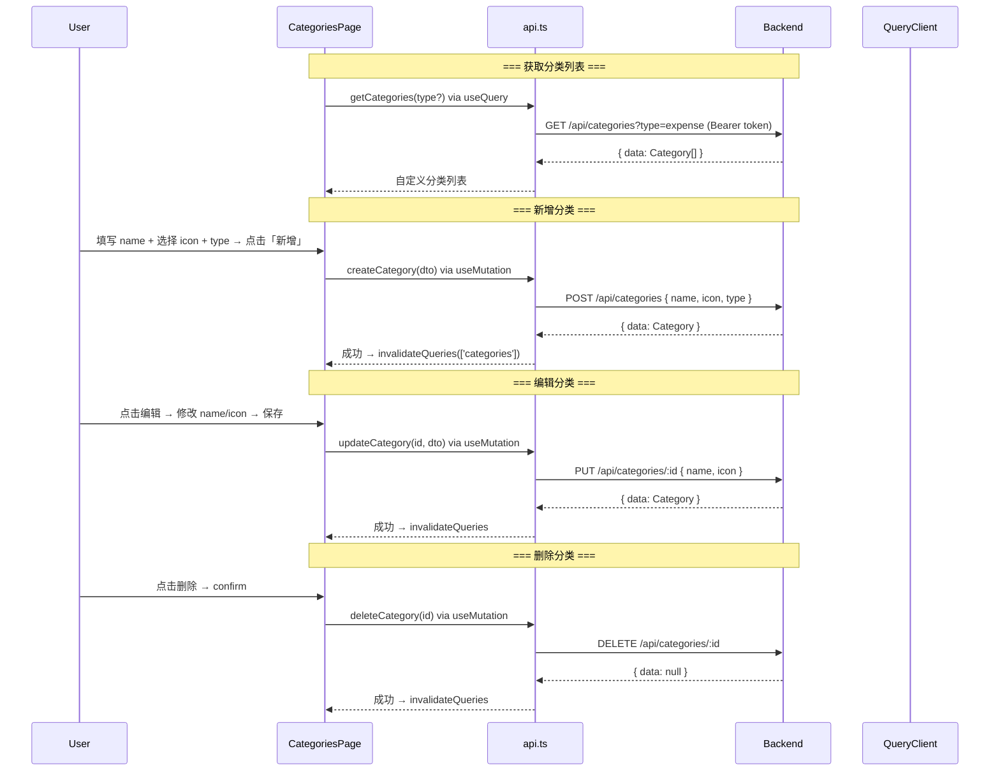
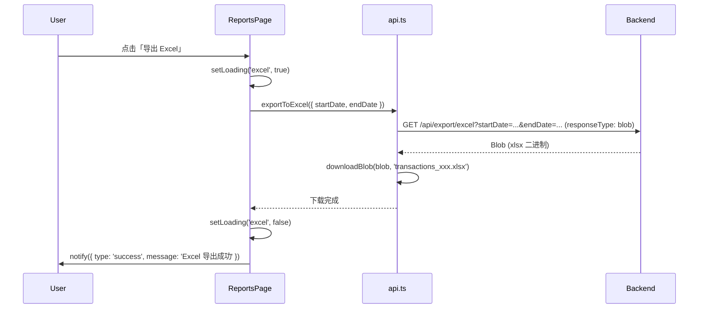
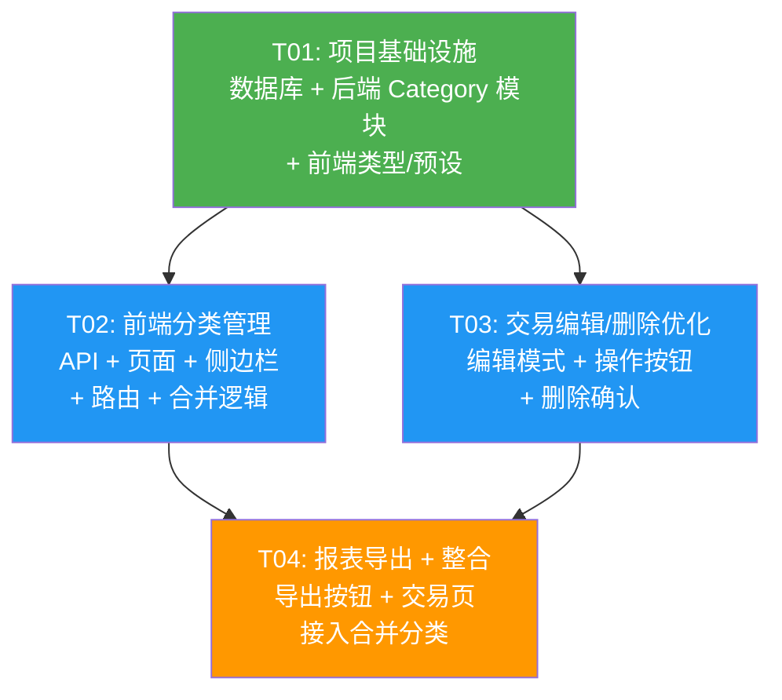

# 家庭记账 P0 迭代 - 系统设计与任务分解

> 架构师：高见远（Gao） | 日期：2025-06-20

---

## Part A: 系统设计

### 1. 实现方案

#### P0-1: 交易编辑/删除优化（仅前端）

**难点分析**：AddTransaction 页当前仅支持创建模式，需改造为创建/编辑双模式复用。

**技术方案**：
- URL 参数检测：`useSearchParams()` 获取 `edit` 参数，存在即进入编辑模式
- 数据预填：`useQuery` 调用 `getTransaction(id)` 获取已有数据，填入 formData
- 提交分流：编辑模式使用 `updateTransaction(id, data)`（PUT），创建模式使用 `createTransaction(data)`（POST）
- Header 标题动态切换："记一笔" vs "编辑交易"
- 删除确认：Transactions 页面新增编辑/删除操作按钮，点击删除弹出浏览器原生 `window.confirm()`（轻量方案，无需额外 Modal 组件）
- 删除后：`deleteTransaction(id)` → `queryClient.invalidateQueries` 刷新列表 → toast 提示

**涉及文件**：
- `AddTransaction.tsx` — 核心改造
- `Transactions.tsx` — 新增编辑/删除按钮逻辑
- `TransactionsList/index.tsx` — 列表项增加操作区
- `TransactionsList/index.scss` — 操作按钮样式

---

#### P0-2: 自定义分类管理（前后端 + 数据库）

**难点分析**：
1. 自定义分类需持久化，且需与现有 `commonDic.ts` 中默认分类共存
2. 默认分类不可编辑/删除，自定义分类可编辑/删除
3. 删除分类不级联交易（保留原 category 字符串值）
4. 分类选择器的选项需要动态合并

**技术方案**：

**数据库**：
- 新建 `categories` 表，关联 `users.id`，唯一约束 `(user_id, name, type)`
- 不使用外键关联 transactions 表（符合"删除分类不级联交易"的要求）

**后端**：
- 新建 `CategoryModule`（NestJS），包含 CRUD 完整实现
- 所有接口 JWT 鉴权（复用 `TokenAuthGuard`）
- 删除接口仅校验 ownership，不检查 transactions 引用
- 响应统一使用 `{ message, data }` 格式（与现有 interceptor 兼容）

**前端**：
- 分类来源合并策略：`commonDic` 默认分类标记 `isDefault: true` + API 自定义分类标记 `isDefault: false`
- 新建 `Categories` 页面：表格展示 + 新增/编辑弹窗（内联 form 或 Modal）+ 删除确认
- 分类选择器（AddTransaction / FilterBar）统一调用合并函数获取全量选项
- 图标使用 emoji 预设列表（40 个常用 emoji），通过选择器点选

**涉及文件**：
- `docs/database-init.sql` — categories 表 SQL
- `backend/src/category/` — 新建模块（controller, service, module, DTOs）
- `backend/src/app.module.ts` — 注册 CategoryModule
- `frontend/src/services/api.ts` — category CRUD API
- `frontend/src/types/category.ts` — 类型定义
- `frontend/src/utils/emojiPresets.ts` — emoji 预设
- `frontend/src/pages/Categories.tsx` — 分类管理页
- `frontend/src/utils/commonDic.ts` — 合并函数
- `frontend/src/components/Sidebar/index.tsx` — 菜单项
- `frontend/src/routes/routes.tsx` — 路由

---

#### P0-3: 报表导出适配（轻量前后端）

**难点分析**：后端导出接口已完整支持 `startDate/endDate` 参数，前端 `exportToExcel`/`exportToPDF` 也已支持 `TransactionFilters`。只需在 Reports 页面 UI 层接入。

**技术方案**：
- Reports 页面 Header 右侧添加两个导出按钮
- 点击时传入当前 `dateRange` 的 `startDate`/`endDate`
- 使用 `useState` 管理 loading 状态，按钮显示 spinner + 禁用防止重复点击
- 移动端通过 flex-wrap 或响应式样式保证布局不溢出
- **后端无需改动**

**涉及文件**：
- `frontend/src/pages/Reports.tsx` — 添加导出按钮及交互逻辑

---

### 2. 文件列表

#### 新建文件

| 相对路径 | 说明 |
|----------|------|
| `backend/src/category/category.module.ts` | 分类模块定义 |
| `backend/src/category/category.controller.ts` | 分类 CRUD 控制器 |
| `backend/src/category/category.service.ts` | 分类业务逻辑 |
| `backend/src/category/dto/create-category.dto.ts` | 创建分类 DTO |
| `backend/src/category/dto/update-category.dto.ts` | 更新分类 DTO |
| `frontend/src/types/category.ts` | 分类前端类型定义 |
| `frontend/src/utils/emojiPresets.ts` | 40 个常用 emoji 预设列表 |
| `frontend/src/pages/Categories.tsx` | 分类管理页面 |

#### 修改文件

| 相对路径 | 说明 |
|----------|------|
| `docs/database-init.sql` | 追加 categories 表 |
| `backend/src/app.module.ts` | 注册 CategoryModule |
| `frontend/src/services/api.ts` | 新增 category CRUD API 函数 |
| `frontend/src/utils/commonDic.ts` | 新增分类合并函数 |
| `frontend/src/components/Sidebar/index.tsx` | 新增"分类管理"菜单项 |
| `frontend/src/routes/routes.tsx` | 新增 `/categories` 路由 |
| `frontend/src/pages/AddTransaction.tsx` | 编辑模式改造 + 使用合并分类 |
| `frontend/src/pages/Transactions.tsx` | 新增编辑/删除操作 + 使用合并分类 |
| `frontend/src/components/TransactionsList/index.tsx` | 新增操作按钮区 |
| `frontend/src/components/TransactionsList/index.scss` | 操作按钮样式 |
| `frontend/src/pages/Reports.tsx` | 新增导出按钮 |

---

### 3. 数据结构和接口

#### 3.1 数据库 — categories 表

```sql
CREATE TABLE IF NOT EXISTS categories (
  id UUID PRIMARY KEY DEFAULT gen_random_uuid(),
  user_id UUID NOT NULL REFERENCES users(id) ON DELETE CASCADE,
  name VARCHAR(50) NOT NULL,
  icon VARCHAR(10) NOT NULL DEFAULT '📌',
  type VARCHAR(10) NOT NULL CHECK (type IN ('expense', 'income')),
  sort_order INTEGER NOT NULL DEFAULT 0,
  created_at TIMESTAMP WITH TIME ZONE DEFAULT NOW(),
  updated_at TIMESTAMP WITH TIME ZONE DEFAULT NOW(),
  UNIQUE(user_id, name, type)
);

-- 索引
CREATE INDEX idx_categories_user_id ON categories(user_id);
CREATE INDEX idx_categories_user_type ON categories(user_id, type);

-- 触发器
CREATE TRIGGER update_categories_updated_at BEFORE UPDATE ON categories
    FOR EACH ROW EXECUTE FUNCTION update_updated_at_column();
```

#### 3.2 后端 API 契约

**Base**: `GET/POST/PUT/DELETE /api/categories`，全部需要 `Authorization: Bearer <token>`

| 方法 | 路径 | 请求体 / 查询参数 | 响应 data |
|------|------|-------------------|-----------|
| `GET` | `/categories?type=expense` | Query: `type` (可选) | `Category[]` |
| `POST` | `/categories` | `{ name, icon, type, sort_order? }` | `Category` |
| `PUT` | `/categories/:id` | `{ name?, icon?, sort_order? }` | `Category` |
| `DELETE` | `/categories/:id` | — | `null` |

**Category 对象结构**：
```typescript
interface Category {
  id: string;          // UUID
  user_id: string;     // UUID
  name: string;        // 分类名称
  icon: string;        // emoji 图标
  type: 'expense' | 'income';
  sort_order: number;
  created_at: string;
  updated_at: string;
}
```

#### 3.3 前端类型定义

```typescript
// frontend/src/types/category.ts

/** 后端返回的分类原始数据 */
export interface Category {
  id: string;
  user_id: string;
  name: string;
  icon: string;
  type: 'expense' | 'income';
  sort_order: number;
  created_at: string;
  updated_at: string;
}

/** 创建分类请求 */
export interface CreateCategoryDto {
  name: string;
  icon: string;
  type: 'expense' | 'income';
  sort_order?: number;
}

/** 更新分类请求 */
export interface UpdateCategoryDto {
  name?: string;
  icon?: string;
  sort_order?: number;
}

/** 合并后的分类选项（用于下拉选择器） */
export interface MergedCategory {
  value: string;       // category key
  label: string;       // 显示文本 "🍜 餐饮"
  icon: string;        // emoji
  name: string;        // 纯文本名称
  isDefault: boolean;  // true = commonDic 默认（不可删除），false = 自定义
  categoryId?: string; // 自定义分类的数据库 ID（默认分类为 undefined）
}
```

#### 3.4 类图

```mermaid
classDiagram
    class Category {
        +string id
        +string user_id
        +string name
        +string icon
        +string type
        +int sort_order
        +string created_at
        +string updated_at
    }

    class CreateCategoryDto {
        +string name
        +string icon
        +string type
        +int? sort_order
    }

    class UpdateCategoryDto {
        +string? name
        +string? icon
        +int? sort_order
    }

    class MergedCategory {
        +string value
        +string label
        +string icon
        +string name
        +boolean isDefault
        +string? categoryId
    }

    class CategoryController {
        +findAll(userId, type?) Promise~Category[]~
        +create(userId, dto) Promise~Category~
        +update(userId, id, dto) Promise~Category~
        +remove(userId, id) Promise~void~
    }

    class CategoryService {
        +findAll(userId, type?) Promise~Category[]~
        +create(userId, dto) Promise~Category~
        +update(userId, id, dto) Promise~Category~
        +remove(userId, id) Promise~void~
    }

    class CategoryDict {
        +expenseCategoryDict: Record~string, {name, icon}~
        +incomeCategoryDict: Record~string, {name, icon}~
        +mergeCategories(defaultDict, customCategories) MergedCategory[]
    }

    CategoryController --> CategoryService
    CategoryService --> Category
    CreateCategoryDto --> Category
    UpdateCategoryDto --> Category
    MergedCategory --> CategoryDict
```

---

### 4. 程序调用流

#### 4.1 P0-1: 编辑交易流程



#### 4.2 P0-1: 删除交易流程



#### 4.3 P0-2: 分类 CRUD 流程



#### 4.4 P0-3: 报表导出流程



---

### 5. 待明确事项

| # | 问题 | 假设/决策 |
|---|------|-----------|
| 1 | 分类管理页是否需要分页？ | 假设自定义分类数量不会超过 50 个，**不做分页**，一次加载全部 |
| 2 | 自定义分类的 sort_order 排序逻辑？ | 按 `sort_order ASC` 排列，sort_order 相同时按 `created_at ASC`。前端拖拽排序为未来迭代（P1），P0 仅支持数值输入 |
| 3 | emoji 选择器 UI 交互？ | 使用 emoji 网格点选（点击即选中），不做搜索。emoji 预设 40 个常用图标 |
| 4 | 删除分类时，已有交易记录的 category 字段如何处理？ | **保留原值**。前端通过 `isDefault: true/false` 区分，若自定义分类被删除，交易记录仍显示原 category 名称（降级显示 key 值） |
| 5 | 编辑交易时，如果 URL 中的 id 不存在？ | 后端返回 403（无权访问）或空，前端捕获后 toast 提示"交易记录不存在"并跳回列表 |
| 6 | 分类名称重复校验？ | 数据库唯一约束 + 后端 try-catch 捕获 Postgres 23505 错误码返回友好提示 |

---

## Part B: 任务分解

### 6. 所需依赖包

本迭代**不引入新的第三方依赖**，全部使用现有技术栈：

**后端**（已有）：
- `@nestjs/common`, `@nestjs/core`, `@nestjs/config` — NestJS 核心
- `@supabase/supabase-js` — 数据库客户端
- `exceljs`, `pdfkit` — 导出功能

**前端**（已有）：
- `react@^18`, `react-router-dom`, `@tanstack/react-query` — 核心框架
- `date-fns` — 日期处理

---

### 7. 任务列表

#### T01: 项目基础设施 — 数据库 + 后端 Category 模块 + 前端类型/预设

| 属性 | 内容 |
|------|------|
| **Task ID** | T01 |
| **Task Name** | 项目基础设施：数据库变更 + 后端 Category 模块 + 前端类型和预设 |
| **Source Files** | `docs/database-init.sql`（改），`backend/src/category/category.module.ts`（新），`backend/src/category/category.controller.ts`（新），`backend/src/category/category.service.ts`（新），`backend/src/category/dto/create-category.dto.ts`（新），`backend/src/category/dto/update-category.dto.ts`（新），`backend/src/app.module.ts`（改），`frontend/src/types/category.ts`（新），`frontend/src/utils/emojiPresets.ts`（新） |
| **Dependencies** | 无 |
| **Priority** | P0 |
| **角色** | 后端 + 前端 |

**工作内容**：
1. 在 `database-init.sql` 末尾追加 `categories` 表建表语句（含索引、触发器、注释）
2. 创建 `backend/src/category/` 完整模块：
   - `category.module.ts`：导入 SupabaseModule、AuthModule，声明 controller 和 service
   - `category.controller.ts`：`@Controller('categories')` + `@UseGuards(TokenAuthGuard)`，实现 `GET /`、`POST /`、`PUT /:id`、`DELETE /:id`
   - `category.service.ts`：通过 SupabaseService 操作数据库，catch 23505 唯一约束冲突
   - `dto/create-category.dto.ts`：`name(string)`, `icon(string)`, `type('expense'|'income')`, `sort_order?(number)`
   - `dto/update-category.dto.ts`：全部字段可选 `Partial<CreateCategoryDto>`
3. 在 `app.module.ts` 中导入 `CategoryModule`
4. 创建 `frontend/src/types/category.ts`：`Category`, `CreateCategoryDto`, `UpdateCategoryDto`, `MergedCategory`
5. 创建 `frontend/src/utils/emojiPresets.ts`：40 个常用 emoji 数组（🛒🍜🚗🛍️📱🏠🎮💊📚📌💼🎁📈💻💰🎂🎉🎯🎨🎵🏥✈️🚌💡🔧🎓🐱☕🎬🏋️📷🌍🔋🎪🎭🎤💍📦🏖️🎿🍺）

---

#### T02: 前端分类管理 — 页面 + API + 侧边栏 + 路由 + 分类合并

| 属性 | 内容 |
|------|------|
| **Task ID** | T02 |
| **Task Name** | 前端分类管理：API 对接 + 管理页面 + 侧边栏入口 + 路由 + 分类合并逻辑 |
| **Source Files** | `frontend/src/services/api.ts`（改），`frontend/src/pages/Categories.tsx`（新），`frontend/src/components/Sidebar/index.tsx`（改），`frontend/src/routes/routes.tsx`（改），`frontend/src/utils/commonDic.ts`（改） |
| **Dependencies** | T01 |
| **Priority** | P0 |
| **角色** | 前端 |

**工作内容**：
1. 在 `api.ts` 中新增 4 个函数：`getCategories(type?)`, `createCategory(dto)`, `updateCategory(id, dto)`, `deleteCategory(id)`，均使用 `requiresAuth: true`
2. 创建 `Categories.tsx` 页面：
   - 顶部切换 Tab（支出分类 / 收入分类）
   - 默认分类区：只读列表，灰色背景，不可编辑/删除，标注"系统默认"
   - 自定义分类区：可编辑列表，每行：emoji 图标 + 名称 + 编辑/删除按钮
   - 新增表单：内联行（emoji 选择器 + 名称输入框 + 确认按钮），emoji 选择器为网格弹窗
   - 编辑：点击编辑 → 该行变为编辑模式（修改 emoji + 名称 → 保存/取消）
   - 删除：`window.confirm('删除后已有交易记录的分类名称将保留，确定删除？')` → 调用 API
3. 修改 `Sidebar/index.tsx`：在"交易记录"和"统计报表"之间添加"分类管理"菜单项，路由 `/categories`，SVG 图标使用 tag 图标
4. 修改 `routes/routes.tsx`：`lazy(() => import('../pages/Categories'))` + `{ path: '/categories', element: <Categories />, isPrivate: true }`
5. 修改 `commonDic.ts`：新增 `mergeCategoryOptions(type, customCategories?): MergedCategory[]` 函数，合并默认分类（isDefault: true）+ 自定义分类（isDefault: false, categoryId）

---

#### T03: 交易编辑/删除优化 — 编辑模式 + 操作按钮 + 确认删除

| 属性 | 内容 |
|------|------|
| **Task ID** | T03 |
| **Task Name** | 交易编辑/删除优化：AddTransaction 编辑模式 + 列表操作按钮 + 删除确认 |
| **Source Files** | `frontend/src/pages/AddTransaction.tsx`（改），`frontend/src/pages/Transactions.tsx`（改），`frontend/src/components/TransactionsList/index.tsx`（改），`frontend/src/components/TransactionsList/index.scss`（改） |
| **Dependencies** | T01（仅依赖类型定义，可与 T02 并行） |
| **Priority** | P0 |
| **角色** | 前端 |

**工作内容**：
1. 改造 `AddTransaction.tsx`：
   - 从 URL 获取 `edit` 参数：`const editId = searchParams.get('edit')`
   - 若 `editId` 存在：`useQuery(['transaction', editId], () => getTransaction(+editId))` 获取数据，预填 formData
   - Header title 动态：`editId ? '编辑交易' : '记一笔'`
   - 提交按钮：`editId ? updateTransaction(+editId, data) : createTransaction(data)`
   - 加载中状态处理，编辑的 transaction 不存在时 toast 提示并跳回
   - 成功后 `queryClient.invalidateQueries({ queryKey: ['transactions'] })`
2. 改造 `TransactionsList/index.tsx`：
   - Props 新增 `onEdit?: (id: number) => void` 和 `onDelete?: (id: number) => void`
   - 每行右侧新增操作区：编辑按钮（✏️）+ 删除按钮（🗑️）
3. 改造 `TransactionsList/index.scss`：操作按钮样式（hover 变色、间距、响应式）
4. 改造 `Transactions.tsx`：
   - 传递 `onEdit` → `navigate(/add?edit=${id})`
   - 传递 `onDelete` → `window.confirm` → `deleteTransaction` via `useMutation` → `invalidateQueries` → toast

---

#### T04: 报表导出 + 分类整合 — 导出按钮 + 交易页使用合并分类

| 属性 | 内容 |
|------|------|
| **Task ID** | T04 |
| **Task Name** | 报表导出按钮 + 交易页面接入合并分类 |
| **Source Files** | `frontend/src/pages/Reports.tsx`（改），`frontend/src/pages/AddTransaction.tsx`（改），`frontend/src/pages/Transactions.tsx`（改） |
| **Dependencies** | T02（依赖合并分类函数），T03（依赖 AddTransaction 编辑模式） |
| **Priority** | P0 |
| **角色** | 前端 |

**工作内容**：
1. 改造 `Reports.tsx`：
   - Header 右侧添加「导出 Excel」「导出 PDF」两个按钮
   - 使用 `useState` 管理 `exportingExcel` / `exportingPdf` loading 状态
   - 点击时调用 `exportToExcel({ startDate, endDate })` / `exportToPDF({ startDate, endDate })`
   - 按钮 loading 时显示 spinner + disabled
   - 成功后 toast："Excel 导出成功" / "PDF 导出成功"
   - 失败时 toast："导出失败: xxx"
   - 移动端适配：按钮使用 `flex-wrap`，小屏缩小 padding
2. 改造 `AddTransaction.tsx` 分类选择器：
   - 使用 `useQuery(['categories', formData.type], () => getCategories(formData.type))` 获取自定义分类
   - 使用 `mergeCategoryOptions(formData.type, customCategories)` 合并默认+自定义
   - 分类 option 渲染时标注默认/自定义（视觉区分为可选）
3. 改造 `Transactions.tsx` 分类字典映射：
   - 使用 `useQuery(['categories'])` 获取所有自定义分类
   - 在 `map` 中优先查自定义分类字典，找不到再 fallback 到 `expenseCategoryDict`/`incomeCategoryDict`

---

### 8. 共享知识

> 以下约定供工程师（Eve）在实现时遵循。

| 领域 | 约定 |
|------|------|
| **API 响应格式** | 后端统一返回 `{ message: string, data: T }`，前端 `request()` 自动解包 `data` |
| **鉴权** | 所有 `/api/transactions`、`/api/categories`、`/api/export`、`/api/statistics` 端点均需 `Authorization: Bearer <token>` |
| **React Query Key** | 命名规范：`['transactions']` / `['transactions', id]` / `['categories']` / `['categories', type]` / `['statistics', 'summary', start, end]` |
| **路由约定** | HashRouter，`/add?edit=id` 编辑模式，`/categories` 分类管理，需登录保护 |
| **Toast 通知** | 使用 `notify({ type: 'success'\|'error', message })`，自动 3 秒消失 |
| **确认弹窗** | P0 迭代使用浏览器原生 `window.confirm()`，不引入额外 Modal 库 |
| **日期格式** | 统一 `yyyy-MM-dd` 字符串，使用 `date-fns` 的 `format()` |
| **分类标识** | `isDefault: true` = 内置不可删，`isDefault: false` = 用户自定义可删 |
| **删除分类行为** | 不级联更新交易记录，交易记录的 category 字段保留删除前的字符串值 |
| **移动端适配** | 所有新增 UI 需考虑 375px 宽度下的可用性（flex-wrap、缩小 padding/font） |
| **emoji 预设** | 统一从 `emojiPresets.ts` 导入，不硬编码 emoji 字符串 |

---

### 9. 任务依赖图



**依赖说明**：
- T02 和 T03 **可并行开发**（均仅依赖 T01）
- T04 必须等 T02 和 T03 都完成后进行整合
- 总共有 **4 个任务**，符合 ≤5 个的硬性上限

---

> 设计完成。请将此文档传递给工程师（Eve）开始实现。
